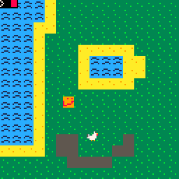
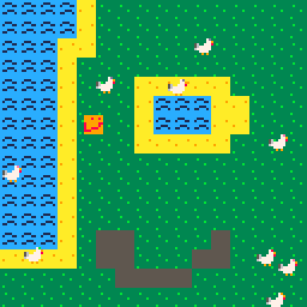

## Quick detour: Functions

We're going to talk about making our own functions, since our `_update` function is getting really crowded and we still have more to go! 

We've used functions before, like `cls()` and `map()`

Functions are essentially just blocks of code that we group together. When we use a function (when we 'call the function'), we just run all the code inside of it. As an example, consider this code
```lua
function prep_screen()
 cls()
 map()
end

function _draw()
 prep_screen()
 
 spr(1, player_x, player_y)
end
```

which is exactly the same as this code

```lua
function _draw()
 cls()
 map()
 
 spr(1, player_x, player_y)
end
```

Functions can also take in arguments--that is, information. As an example, consider `spr.` `spr` takes in three pieces of information (arguments): the sprite number, the x-coordinate of where to draw it, and the y-coordinate of where to draw it. 
Functions can also return information, making it avaliable to us. 

Let's see an example. Earlier, we had some code which computed the corner of the room the player was in. Let's make some functions which take a point's coordinates, and returns the corner of the room the point is in. This way, in our `_update` function, we can use these two smaller functions.

```lua
function room_corner_x(x, y) -- this function takes in an x value and a y value
 roomx = flr(x / 128)
 roomx = roomx * 128
 return roomx
end

function room_corner_y(x, y)
 roomy = flr(y / 128)
 roomy = roomy * 128
 return roomy
end

function _update()
 camera(room_corner_x(player_x, player_y), room_corner_y(player_x, player_y))
end
```

So, when we run `_update,` it will ask `room_corner_x` to compute the x coordinate of the room, and then `room_corner_y` to compute the y coordinate of the room. Say that `room_corner_x` finds a value of 128 and `room_corner_y` a value of 256. Then, the line of code 

```lua
camera(room_corner_x(player_x, player_y), room_corner_y(player_x, player_y))
```

will be replaced with

```lua
camera(128,  256)
```

Functions can be helpful when we have a lot of code, and soon we'll see very powerful things functions can do.

## Chickens

Our player is fairly lonely. Let's give them some company by adding chickens to the game. The chickens will move around the screen as they please--the player will not be able to control them.


While I'll be adding chickens to my game, feel free to add whatever type of animal you want to yours--a pig, a cow, or even an asteroid!

Like our player, each chicken needs an x and a y coordinate. Let's see what that might look like:

```lua
chicken1_x = 45
chicken1_y = 70

chicken2_x = 60
chicken2_y = 32
```

The x and y values I choose were arbitrary--you can make them anywhere on the screen if you want.

Now that we have this, let's start drawing the chicken to the screen. We'll do this using the sprite function from earlier. I use sprite number 6 as my chicken sprite, but you may have yours in a different spot--make sure to check the sprite number before copying this code!

```lua
chicken_sprite = 6

function _draw()
 spr(chicken_sprite, chicken1_x, chicken1_y)
 spr(chicken_sprite, chicken2_x, chicken2_y)
end
```

I use `chicken_sprite` instead of 6 when using `spr` to help prevent errors--if I had a typo and accidentally typed 5 in the first call, I'd get some weird looking chickens. Now if I have a typo, for example mistakenly typing `chicken_site` Pico will give me an error since it doesn't know what `chicken_site` is.

Now, my chickens will be on screen, but they won't move at all! (If you can't see your chickens, they might be in a different room--try wandering around your map more, or move the chickens to start in the same room as the player.)

This is because we never change the x and y coordinates of the chickens. We moved the player by reading the key input--but these chickens should move on their own, not be controlled by the player! So, how should we move chickens?

At a high level, we might think of this movement plan:
 * Pick a random direction the chicken will move in
 * Move in that direction for a few seconds
 * Pick a new direction and start again

Let's start by picking random directions. In Pico, we can generate random numbers using the `rnd` function. `rnd` takes an upper bound, and generates random numbers between 0 and the upper bound. For example, `rnd(2)` can generate 0, 1, 0.5923, or 1.94523, but it won't generate 2 (the upper bound isn't included), -0.0532, or 2.52. 

First, I will pick a direction to move horizontally: Left, right, or don't move horizontally. There are three possibilities here, so to capture them all I will use `flr(rnd(3)).` This is because `rnd(3)` will give us a number from 0 to 1, a number from 1 to 2, or a number from 2 to 3. If it gives us a number between 0 and 1, `flr(rnd(3))` will give us 0. If it gives us a number between 1 and 2, `flr(rnd(3))` will give us 1. And if it gives us a number between 2 and 3, `flr(rnd(3))` will give us 2. So, `flr(rnd(3))` will randomly generate either 0, 1, or 2-- three values, each of which corresponds to a direction.

Now, we can add some code to update which moves the chickens randomly in a direction:

```lua
chicken1_directionx = 0

function _update()
 chicken1_directionx = flr(rnd(3)) -- pick chicken1's horizontal direction
 
 if chicken1_directionx == 0 then
  chicken1_x = chicken1_x - 1 -- move left
 elseif chicken1_directionx == 1 then
  chicken1_x = chicken1_x + 1 -- move right
 end -- since a direction of 2 corresponds to not moving, we do nothing in that case
end
```

(A clever way of doing the same thing with less code is to do subtract 1 from the direction, and then set `chicken1_x` to `chicken1_x + direction.` Try working out how this does exactly the same thing as the long `if` statement.)

Now that we have horizontal movement, also add in vertical movement.

## Fixing our chicken movement

The movement system from before words, but it looks very artificial and jagged; look at this:



This is because the chickens randomly pick a new direction to move in after moving just one step in the new direction! Real chickens are not so indecisive; they'll pick a direction and stick with it for a few seconds, before picking a new one.

To deal with this, let's go back to our movement idea:
 * Pick a random direction the chicken will move in
 * Move in that direction for a few seconds
 * Pick a new direction and start again

We're picking a random direction, but we're not moving in it for a few seconds--just for a moment. To fix this, let's also randomly generate a length of time to move in the new direction.

```lua
chicken1_path_length = 0
chicken2_path_length = 0
```

`path_length` will represent the length we're going to travel before changing directions again. So, let's tweak our `_update` function:

```lua
function _update()
 if chicken1_path_length > 0 then
  -- move the chicken according to its direction like before
  
  -- now, subtract 1 from path length since our chicken just took 1 step
  chicken1_path_length = chicken1_path_length - 1
 else 
  -- pick a new direction for the chicken like before
  
  -- now, randomly generate a path length
  chicken1_path_length = flr(rnd(30)) + 10
 end
end
```

I added 10 to `flr(rnd(30))` so that it isn't too small--this way, I know that the path will always be at least 10 steps long. Feel free to change the numbers 10 and 30 as you please to make the movement fit well with your game and the object you're making.

## Tables: A place to keep all of your chicken information

Our chicken movement looks smooth, but our code is a little messy: I have a lot of variables starting with `chicken1` or `chicken2,` and adding a third chicken would be a nightmare: I'd have to add a lot more variables and add a lot of code to our `_update` and `_draw` functions to take care of the chicken. To help make this easier, I'm going to use a combination of **tables** and **functions** (remember functions?). 

First, what is a table? A table is essentially a collection of related variables. 

Let's see an example:

```lua
chicken1 = { -- use this to tell Pico that chicken1 is a table
 x = 30
 y = 52
 directionx = 0
 directiony = 0
 path_length = 0
} -- use this to tell Pico this is where our chicken1 table ends
```

In the example, `chicken1` is a table holding a few variables: `x, y, directionx, directiony,` and `path_length.` All of these variables are related to `chicken1` and so we're grouping them together.

**Warning:** We can't just say `x` or `y` to use the variables inside `chicken1.` We have to say `chicken1.x` and `chicken1.y` to tell Pico to look for x and y inside of the `chicken1` table.

We can use functions to automate this a little. We know that each chicken has a x coordinate, y coordinate, a direction, and a path length. So, I will make a function which takes in this information and gives back a table containing it all.

```lua
function make_chicken(x, y, directionx, directiony, path_length)
 new_chicken = { -- tell Pico that new_chicken will be a table
  x = x
  y = y
  directionx = directionx
  directiony = directiony
  path_length = path_length
 }
end
```

One important thing to note is that, in the line `new_chicken.x = x,` the code `new_chicken.x` refers to the x value inside of the `new_chicken` table, whereas the code `x` on the rightside refers to the value for `x` that our function recieves (the argument). 

Now, we can replace all of our chicken variables with the following two lines of code:

```lua
chicken1 = make_chicken(30, 50, 0, 0, 0)
chicken2 = make_chicken(30, 10, 0, 0, 0)
```

## Chicken Functions

Now that we have chicken tables, let's make some chicken functions!

Remember all the code we used to move a chicken? For each new chicken we make, we'd have to add all that code to `_update` but with the new chicken's name. To save ourselves some time, let's put that code into a function:

```lua
function move_chicken(chicken)
 if chicken.path_length > 0 then
  if chicken.directionx == 0 then
   chicken.x = chicken.x - 1
  elseif chicken.directionx == 1 then
   chicken.x = chicken.x + 1
  end
  
  if chicken.directiony == 0 then
   chicken.y = chicken.y - 1
  elseif chicken.directiony == 1 then
   chicken.y = chicken.y + 1
  end
  
  chicken.path_length = chicken.path_length - 1
 else 
  chicken.directionx = flr(rnd(3))
  chicken.directiony = flr(rnd(3))
  
  chicken.path_length = flr(rnd(30)) + 10
 end
end

function _update()
 -- instead of our old chicken movement code, now we just have these two lines:
 move_chicken(chicken1)
 move_chicken(chicken2)
end
```

We can do something similar with `_draw` to make our lives easier:

```lua
function draw_chicken(chicken)
 spr(chicken_sprite, chicken.x, chicken.y)
end

function _draw(chicken)
 -- instead of our spr calls, we can just use this:
 draw_chicken(chicken1)
 draw_chicken(chicken2)
end
```

Now, adding more chickens is easier than before--but still not as easy as possible. I'd like to just be able to use one function, `make_chicken,` to create a new chicken, and then never have to worry about that chicken again--have the code do everything. For that, we'll need...

## A table of chickens

A table holds a group of related variables. Our `chicken1` and `chicken2` variables are related, so let's put them in a table together:

```lua
chickens = {}
chickens.chicken1 = chicken1
chickens.chicken2 = chicken2
```

Now, we can use a powerful function called `foreach.` 

```lua
function _update()
 foreach(chickens, move_chicken)
end

function _draw()
 foreach(chickens, draw_chicken)
end
```

`foreach(chickens, move_chicken)` means to do `move_chicken` for each chicken inside of the table `chickens.` So, if we only had `chicken1` and `chicken2` inside of `chickens,` the line

```lua
foreach(chickens, move_chicken)
```

would be replaced with


```lua
move_chicken(chickens.chicken1)
move_chicken(chickens.chicken2)
```

This makes adding more chickens much easier: Now, instead of having to type `move_chicken(chicken3)` in my `_update` function and then `draw_chicken(chicken3)` in the `_draw` function, I can just add `chicken3` to the `chickens` table and Pico will take care of the rest!

This is much better than before, but we're not quite at what I wanted: I want `make_chicken` to do all the work, so I don't have to manually add the code which adds my new chicken to the `chickens` table.

However, we're at a dilemma with implementing this: `make_chicken` has no way of knowing how many chickens are in the table--it doesn't know if it should add the new chicken to `chickens.chicken3,` `chickens.chicken4,` or `chickens.chicken500.`

Luckily, Pico has a workaround: The `add` function. `add(chickens, new_chicken)` will put `new_chicken` at the end of the `chickens` table. So, we just need to add that one line of code to `make_chicken`, and then whenever we want to make a new chicken, we just use `make_chicken` and Pico will do the rest for us!

## Loops

Let's say I want to have 10 chickens in my game. Before, I'd have to add a lot of code. Now, at the start, I just do

```lua
make_chicken(0, 0, 0, 0, 0)
make_chicken(10, 10, 0, 0, 0)
make_chicken(20, 20, 0, 0, 0)
make_chicken(30, 30, 0, 0, 0)
make_chicken(40, 40, 0, 0, 0)
make_chicken(50, 50, 0, 0, 0)
make_chicken(60, 60, 0, 0, 0)
make_chicken(70, 70, 0, 0, 0)
make_chicken(80, 80, 0, 0, 0)
make_chicken(90, 90, 0, 0, 0)
```

However, that's still a lot more code than I want. I'd like a function `make_chickens` which takes in a number of chickens, and then makes that many chickens and places them randomly on my map.

How should we do that? Well, to add a chicken at a random location, we'd use

```lua
make_chicken(rnd(128), rnd(128), 0, 0, 0)
```

This will pick a random point in the first room, and add make a chicken there. (If you want your chickens to spawn all over the place, just change `rnd(128), rnd(128)` to `rnd(1024), rnd(512)` since the map is 1024 pixels by 512 pixels.)

Now, I want this code to run a number of times depending on what number I give my `make_chickens` function. To do this, I will use a `for` loop.

```lua
function make_chickens(number_of_chickens)
 for i=1, number_of_chickens do
  make_chicken(rnd(128), rnd(128), 0, 0, 0)
 end
end
```

A `for` loop will run multiple times. Note how we said `i=1, number_of_chickens.` This means that it will create a counter starting at 1, run the code indented below `for` statement and before the `end`, then advance the counter to 2, run the code again, ..., until it finally advances the counter past `number_of_chickens,` at which point it stops.

We can use the counter variable inside the body of our loop if we so desire, but we can't use it before or after the loop.

So, now my 9 chickens can be added with just one line of code:

```lua
make_chickens(9)
```

Talk about easy!


