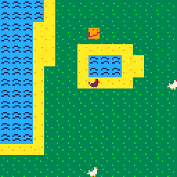

## Big maps, small screens

Now, we still have an issue: The map is big. So big, the screen can't fit it all at once! 

The player can try moving off the screen, but it's no help: The player runs off the screen to a different part of the map, but Pico doesn't follow him, and we only see the starting area.


So, we need to tell Pico to run along with the player once they go to another part of the map. We can do this using the `camera` function. 

Pico has a little camera which takes pictures of what it sees, and then reports it back to us. At the start of the game, the camera is at the top left corner of the map, so it only sees the tiny portion of the map that can fit on the screen. Since our code only tells the player to move, and never moves the camera, we don't follow the player around!

So, we need to move the camera around with the player. One way of doing it might be to tell the camera to move with the player, by adding this to the end of our `_update` function

```lua
function _update()
 camera(player_x, player_y) -- move the camera to (player_x, player_y), the same place the player is
end
```

But this doesn't end up looking very nice...


The issue is the camera is in the same spot as the top left of the player. And since the camera makes the pixel it occupies become the top left corner of the picture it takes, the player will always be in the top left. 

We can fix this in multiple ways: We could try to offset the camera a little so that the player ends up in the center of the screen (how Mario does it), or make it so the camera stays mostly still, but 'jumps' everytime the player leaves the screen (like Zelda). We'll be implementing the second approach in this workshop, but feel free to try implementing the first one if you want to. 

## Fixing the camera

Let's divide the map into a number of screen sized 'rooms.' We want the camera to display the 'room' the player is currently in, like so:


To achieve this, we'll need to do two things:
 * Determine the top left corner of the room the player is in
 * Move the camera to that top left corner
 
So, let's try and figure out the top left corner of the room the player is in.

To do this, let's look at a few examples. Remember that the screen is 128 by 128 pixels, and our rooms are also going to be 128 by 128 pixels.

The starting room the player is in has a top left corner of `(0, 0).` If the player moves 128 pixels to the right of that point, to get to `(128, 0),` they will run into the second room. So, the top left corner of this second room is `(128, 0).` However, if the player moves to `(134, 0)` they will still be in the second room. To deal with this, I will start by dividing the x-coordinate by 128 like so:

```lua
function _update()
 roomx = flr(player_x / 128)
end
```

The `flr` function stands for floor, and just means to round down to the nearest whole number: So `flr(14.32)` is 14, and `flr(4213.999)` is 4213. Why might this be useful? Because it tells us how many times 128 fits into the x-coordinate of the player. So, `flr(134 / 128)` and `flr(128 / 128)` both give back 1, indicating that 128 goes into both 134 and 128 only once. 

Then, we multiply this number by 128.
```lua
function _update()
 roomx = flr(player_x / 128)
 roomx = roomx * 128
end
```
Thus, if you're at an x-coordinate of 134, the first line will set `roomx` to 1, and the next line will set `roomx` to 128. More generally, the first line of code will find out how many rooms to the right you've gone, and then the next line of code will multiply that number by 128, since each room is 128 pixels wide. This will help us find the x coordinate of the top left corner of the room: First, we find which room we're talking about by doing `flr(player_x / 128),` and then we multiply by 128 since each room is 128 pixels wide.

We can do something similar to find the y-coordinate (try and figure it out yourself before checking our code) and then set the camera to this `(roomx, roomy)` coordinate.

```lua
function _update()
 roomx = flr(player_x / 128)
 roomx = roomx * 128
 
 roomy = flr(player_y / 128)
 roomy = roomy * 128
 
 camera(roomx, roomy)
end
```

Now, we will have the camera system we wanted!

## Making the player a table

We use tables to group related variables. `player_x` and `player_y` are related, so why not group them? 

```lua
player = {}
player.x = 0 -- this will be the starting position of the player; feel free to change
player.y = 0
```

The advantage to doing this is now our `bound` function works with the player. This is because `bound` **doesn't care what type of table (chicken or player) you give it, it just cares if that table has an `x` and a `y` variable.** This means that we can use `bound` on the player, too!

```lua
function _update()
 -- move the player and chickens
 
 bound(player) -- bound the player
 foreach(chickens, bound) -- bound each chicken
end
```

## Making solid tiles: Flags

Right now, our player can walk on water (in your games, they may be able to walk through walls or on something else they shouldn't be able to). We'd like to stop this, but first we need to tell Pico which things the player can and can't walk on. 

We can do this by going back to the sprite editor and setting **flags** on our sprites.


Those eight little buttons next to the sprite are all flags. By default, they all start as off and we can turn them on by clicking them.

To help Pico know which things we can and can't walk on, let's use flags: Flag 0, the leftmost flag, will represent if the tile can be walked on or not. If the flag is off, the player can walk on it, and if the flag is on, the player cannot walk on it.

In my game, I'll turn on flag 1 for my water sprite, and leave it off for the rest of them.


Now that we've set the flags, we can start programming our collision detection.

## Collision detection: Planning

Let's make a high level plan for how our collision detection should work. Say we want to move an object to some point (x, y). Before moving it, we should:

* Check if (x, y) is clear--nothing (like ocean) blocking it
* If it is, move them there
* Otherwise, don't move them

Right now, I'm only going to check if (x, y) is on a part of the map we don't want to touch, like water. Later, when we implement enemies, we'll talk about how to check if (x, y) is inside of the player or a chicken. 

I'd also like my collision detection to be in it's own general function, just like `bound` was. I'll call this function `move_to`. It will take a point and an actor, and move the actor to the point if it can.

## Collision detection, now with code!

Alright, so now let's program our `move_to` function. 

First, we need to figure out if `(x, y)` is a point we can move on or not. For this, we're going to use two functions: `mget` and `fget`. `mget` will return which type of sprite (remember sprite numbers?) is at a point on the map, and `fget` will help us figure out which flags are on or off in a sprite if we give it a sprite number. So, we use `mget` to find which sprite (x, y) is, and then use `fget` to check if that sprite is solid or not (remember how we used flag 0 to tell Pico which tiles were solid?)

So, we might try this:

```lua
function move_to(x, y, actor) -- actor could be a player, a chicken, or something else we add in the future
 sprite = mget(x, y)
 solid = fget(sprite, 0)
end
```

`solid = fget(sprite, 0)` will return `true` if flag 0 is turned on, and `false` if it is turn off. However, this code has a very subtle flaw--`(x, y)` returns to coordinates in terms of pixels. If I give you the point `(124, 312)` it means to go 124 pixels right, and then 312 pixels down. But `mget` takes map coordinates, which mean you should 124 sprites right, and then 312 sprites down--to a much different point!

In our map editor, we can view the map coordinates of each sprite at the bottom of the screen:


Hmm. So, we need to convert `(x, y)` from pixel coordinates to map coordinates. How should we do this?

Let's look at an example. The pixels at `(0, 0), (4, 7), (7, 3)` are all inside the top left sprite. This is because they each tell us to move an amount of pixels right that is smaller than 8 and an amount of pixels down smaller than 8. To pass into a new tile, we'd need to move at least 8 pixels. This is key to our solution: To convert, we use `flr(x / 8)` and `flr(y / 8)`. (Remember that `flr` just means round down.) This is because `flr(x / 8)` will tell us how many groups of 8 pixels we've moved right--in other words, how many tiles right we've moved. So, we can now fix our code:

```lua
function move_to(x, y, actor)
 sprite = mget(flr(x / 8), flr(y / 8))
 solid = fget(sprite, 0)
end
```

Now, we should only move the actor if the sprite is not solid.

```lua
function move_to(x, y, actor)
 sprite = mget(flr(x / 8), flr(y / 8))
 solid = fget(sprite, 0)
 
 if not(solid) then
  -- (x, y) is fine to move too
  actor.x = x
  actor.y = y
 end
end
```

Note the `not(solid)` in the `if` statement. `not` is a function which returns the opposite of a `true` or `false` value-- so `not(true)` would be `false` and `not(false)` would be true. 

Now, we slightly tweak how movement works. For the player, our current code looks as so:
```lua
function _update()
 if btn(0) then
  player.x = player.x - 1
 end
 
 if btn(1) then
  player.x = player.x + 1
 end
 
 if btn(2) then
  player.y = player.y - 1
 end
 
 if btn(3) then
  player.y = player.y + 1
 end
end
```

Instead of doing that, I'll store a potential position, and then use `move_to` to check.

```lua
function_update()
 potentialx = player.x
 potentialy = player.y
 
 if btn(0) then
  potentialx = potentialx - 1
 end
 
 if btn(1) then
  potentialx = potentialx + 1
 end
 
 if btn(2) then
  potentialy = potentialy - 1
 end
 
 if btn(3) then
  potentialy = potentialy + 1
 end
 
 move_to(potentialx, potentialy, player)
end
```

Done! Now, the chickens. Their movement happens in a the `move_chicken` function. Try modifying that function to use `move_to` instead of moving the chicken directly.

## Let's go down!

Our collision code is done! Let's play:


Shoot. It only works half the time?

Let's think about what's happening. Remember that `player.x` and `player.y`refer to the **top left corner** of the player. So, when we say `move_to(x, y, player)` we only check if the top left corner of the player will go to a valid spot--not if every part of the player will!

To fix this, I'm going to first add a second function, `on_solid`, which checks if a point is on a solid sprite:

```lua
function on_solid(x, y)
 sprite = mget(flr(x / 8), flr(y / 8))
 solid = fget(sprite, 0)
 return solid -- give back solid to whoever uses this function
end
```

Now, I'll modify `move_to` a little. Instead of just checking `(x, y)` I will have it also check the other three corners of the actor. 

Wait, where are the other three corners of the actor, if the top left corner is `(x, y)`? Remembering that the sprites in Pico are 8 pixels by 8 pixels, it might be temping to say those other corners are at `(x + 8, y), (x + 8, y + 8),` and `(x, y + 8).` 
This is wrong for a subtle reason. Let's implement the rest of our collision code, then see why:

```lua
function move_to(x, y, actor)
 corner1 = on_solid(x, y)
 corner2 = on_solid(x + 8, y)
 corner3 = on_solid(x + 8, y + 8)
 corner3 = on_solid(x, y + 8)
 
 if not(corner1) and not(corner2) and not(corner3) and not(corner4) then
  actor.x = x
  actor.y = y
 end
end
```

The first four lines will check if each corner is solid, and store the answer in the variables `corner1` through `corner4`. Then, we check that *each corner* is not solid before moving. (Question to you: Why can I just check corners instead of having to check every single pixel of the player?)

Let's test this out:


Uh oh! I can't go to the edge, just one pixel away from it. My corner locations were wrong--`(x + 8, y)` isn't actually the top right corner. To see this, note that `(x, y)` is the top left pixel of my player. So, `(x + 8, y)` is the pixel 8 pixels away from that pixel. This means that a sprite with corners at `(x, y)` and `(x + 8, y)` would be 9 pixels wide, not 8. We have 1 pixel from `(x, y)`, plus 8 more since `(x + 8, y)` is 8 pixels away, giving us 9 pixels total. So, we'd actually want to use `(x + 7, y)`. Similary we change all the 8's to 7's to get the desired effect.

Finally! Right?

## Let's go up and left!

Our code still has a small problem. Say we want to go both up and left at the same time. This is fine. But the tile to our upper left is solid, so we can't walk there--no biggy, `move_to` just won't move us. But what if the tile to our immediate left is fine? Instead of moving left, we just won't move at all. I'd like pressing left to move me left whenever possible. 

So, I'll change my collision code one last time. Instead of checking if it can move me on the x-axis and the y-axis at the same time, I'll have it first check the x-axis and then check the y-axis.

```lua
function move_to1(x, y, actor)
 corner1 = on_solid(x, y)
 corner2 = on_solid(x + 8, y)
 corner3 = on_solid(x + 8, y + 8)
 corner3 = on_solid(x, y + 8)
 
 if not(corner1) and not(corner2) and not(corner3) and not(corner4) then
  actor.x = x
  actor.y = y
 end
end

function move_to2(x, y, actor)
 move_to_partial(x, actor.y, actor)
 move_to_partial(actor.x, y, actor)
end
```

Let's see what I did here. `move_to1` is just our old `move_to` function. The new `move_to2` function will first move the actor on the x-axis using our old code, and then move them on the y-axis using our old code. This way, we can choose whether or not we want the `move_to1` style movement or the `move_to2` style movement (and it also made writing `move_to2` really quick!). I prefer using `move_to2` but feel free to use what fits best with your game. 

## Fixing chicken spawns

Chickens can still spawn on water... shit.

have `make_chickens` check if the tile it wants to spawn on is good.

## Enemies: A plan

We have friendly chickens, so why not add some unfriendly chickens?

<image of bad chicken>
  
My goal for these unfriendly chickens is the following:

* The squares randomly walk around the map until they're in the same room as the player
* If they're in the same room as the player, they move towards the player
* If they touch the player, they do a little damage to the player and then explode

Here's an example of what I want to happen:

<gif of chicken attack>

## Tables of enemies

With chickens, we used functions and tables to make our lives easier later on; adding a lot of chickens to our game is a breeze!

We'd like to be able to do that with enemies, as well. 

Let's get a few functions made.

```lua
enemies = {} -- our table of enemies

function make_enemy(x, y)
 enemy = {
  x = x
  y = y
 }
 add(enemies, enemy)
end

function update_enemy(enemy)
 
end

function draw_enemy(enemy)
 spr(enemy.x, enemy.y, 6) -- replace 6 with your enemy sprite
end
```

These functions are fairly bare bones now, since we don't yet have an idea for enemies.

**Your Task: Get some enemy code!** Our chickens have `dirx` and `diry` variables telling them which direction to move in. Add these variables to our enemies, and add some code which (just like we did for chickens) moves them in `dirx` and `diry`. Remember to check for collisions--and also, our collision functions earlier will still work here...

## Chasing the player

We want the enemy to chase the player. Thinking about this at a high level, making an enemy chase the player seems easy: Have them run in the direction of the player! If the player is above them, move up. If the player is to their bottom right, move down and right. Easy enough! Now, how should tell the enemy to change directions to the player? Functions!

Let's make a `charge_player` function, which will be called whenever the enemy is close enough to the player. I will make this happen whenever the player and the enemy are on the same screen, but you can decide for yourself when `charge_player` should be called.

```lua
function charge_player(enemy)
	if player.x > enemy.x then
		enemy.dirx = 1
	elseif player.x < enemy.x then
	 enemy.dirx = -1
	else
	 enemy.dirx = 0
	end
	
	if player.y > enemy.y then
		enemy.diry = 1
	elseif player.y < enemy.y then
	 enemy.diry = -1
	else
	 enemy.diry = 0
	end
end
```

Let's try this out!



Hmm... what's going on here? Try thinking about this a little before reading.

Well, the enemy has the right x-coordinate. The enemy doesn't need to move left or right to get closer to the player, so it only tries to move up. But up gets you stuck in a lake! The poor enemy doesn't know this, and keeps trying it's hardest to go up against the current.

How can we fix this? Well, we need to detect when our enemy becomes stuck. 

## Getting unstuck
  
To detect when we're stuck, we'll use `stuckx` and `stucky.` 

Above, we got stuck because the chicken wasn't moving left or right--only up--but wasn't getting anywhere because of the obstacle. Our enemy wanted to move up but could not due to an obstacle. So, when getting stuck, we should check:

* Do we have the same x-coordinate as the player?
* Are we stuck-- that is, are we not moving where we want to be moving?

Where the enemy wants to move is `enemy.y + enemy.diry`. So, we'll check two things: Is the enemy at a point where they don't want to move left/right anymore, but not moving where they want to up/down?
  
```lua
if enemy.dirx == 0 and enemy.y != enemy.y + enemy.diry then
 enemy.stuckx = true
 move_to(px - 1, py, enemy)
else
 enemy.stuckx = false
end
```

This code will make `stuckx` true only if we're stuck and we need to move left or right to escape. Then, we move 1 pixel left. While `stuckx` is on, we'll keep moving the enemy left even if that sends them further away from the player--this way, they keep moving left until they get around the obstacle.

We want to do the same thing in the other direction, as well: 

```lua
if enemy.diry == 0 and enemy.x != px then 
 enemy.stucky = true
 move_to(px, py - 1, enemy)
else
 enemy.stucky = false
end
```

## Another issue...

Thinking from a high level, our code still has an issue--what if moving left just sends them to another wall, and they can't keep going left? Shoot. 

If an enemy is stuck and keeps going left, only to bump into another wall, send them right! Or, better yet, before moving check 
if left or right would be the better direction (aka faster). 

Let's imagine we're trying to go up, but get stuck. Alright, so we need to keep moving in the x-direction until the tile above us is a tile we can walk on--that way, we can actually go up! Then, we'll start moving normally again. So, we should first check how much to the left we'd need to move, then check how much to the right we'd need to move. Then, whichever path is shorter, we'll take. The only problem is, we don't know this in advance--we'd need some code which keeps incrementing a counter by 1 until we can walk on the tile above us...

## While Loops to the Rescue!

A `while` loop will keep repeating a block of code while something is true. 

Let's see how this can solve our problem: Say the enemy is on the tile with coordinates `(x, y)` and becomes stuck. Instead of just moving left, let's pick either left or right based on our while loop. 

```lua
tiles_left = 0
while fget(mget(x - tiles_left, y - 1), 0) do
 tiles_left = tiles_left + 1
end
```

Note `do` and `end`. Also, remember `mget` and `fget`? They helped us out in collision detection. `mget` just figures out which sprite is on a tile, and `fget` returns is a flag is on. This is useful, since flag 0 indicates a tile is solid. So, `fget(mget(x- tiles_left, y - 1), 0)` returns `true` if the tile at `(x - tiles_left, y - 1)` is solid, and false if we can walk on it. (Remember that `(x - tiles_left, y-1)` is just the tile above the tile at `(x - tiles_left, y)`, which is where our enemy would end up moving before it started going up!) Now, do something similar with `tiles_right`, counting how many tiles right we'd need to move before we can go up again.

Now, instead of just moving left when `stuckx` is true, we'll pick a better direction and move in that direction.

However, our code still has one flaw: What if the obstacle goes off very far to the left, so we run into the edge of the map before we can go over it? To fix this, we'll just check that `x - tiles_left >= 0` since any negative coordinates are off the map.

**Your Task: Our code isn't the best with corners yet. Fix it.** Think about what happens when the chicken goes into a corner with our current code. The situtation is a little dire. Figure out what the bug is, why it's happening, and how to stop it. 

## Disappearing

Let's make chickens disappear when they touch the player. To do this, first we will need a way to tell when the chicken is touching the player. I'll make a `touching` function which takes two entities (aka, living things) and returns when they are touching. 

Naively, we might thing this is as simple as checking they have the same coordinates. But alas, it's not that simple: The coordinate only checks if they have the exact same top-left pixels, not if they're touching! 

To do this, remember that in Pico, objects are 8-pixels wide. So, we want to check if my top left corner within 8-pixels going left or right of your top corner, and within 8-pixels going up and down, as that indicates we'll be touching somewhere. To do this, we'll look to math: The absolute value function! `abs(x1 - x2)` will return the distance between `x1` and `x2`. So, `abs(x1 - x2) < 8` will check if the x-coordinates are within 8-pixels of each other, and `abs(y1 - y2) < 8` will check if the y-coordinates are good.

So, our `touching` function is this:

```lua
function touching(e1, e2)
	xgood = abs(e1.x - e2.x) < 8
	ygood = abs(e1.y - e2.y) < 8
	return xgood and ygood
end
```

**Your task: Make enemies disappear when they touch the player!** To do this, you will need the `del` function. `del` takes a table and something in that table, and deletes it from the table. So, for example, `del(enemies, very_bad_enemy)` will remove `very_bad_enemy` from the table of enemies--so that we no longer update the enemy or draw it to the screen!

## Moving On!

Congratulations, you've finished our workshop! Try to extend your game.
