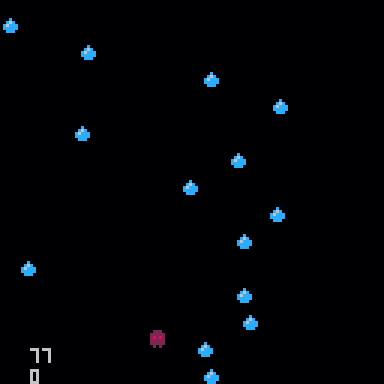
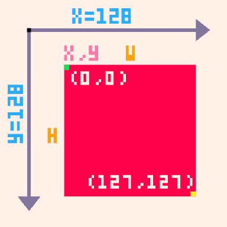
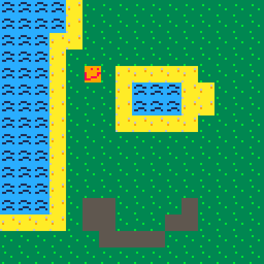

## Getting Started
This workshop requires a copy of [Pico-8](https://www.lexaloffle.com/pico-8.php), which unfortunately costs $15. The good news is that Pico-8 is DRM-free, which means that you can share one license with your whole club.

It is also strongly recommended that you download this wonderful cheatsheet:


One common practice is to fullscreen it behind Pico-8, like so:


## Let's go!
Tired of complex workflows and high-definition graphics? Well, the Pico-8 fantasy console is here to help. Through the course of this workshop you will make [this](demos/final.html) action game. Along the way you'll learn how to use the Pico-8 console along with the basics of Lua scripting.

<iframe src="demos/demo.html" width="100%" height="700px">
  <image src="assets/demo.gif">
</iframe>

A couple of basic pieces of information about Pico-8: there are three modes.

 * The console mode

   

   This is what you see on startup, and allows you to run a couple of basic commands. Don't worry too much about it for now.

 * The editor mode

   

   This is where you make your game. The editor has multiple tabs that give you access to various bits of functionality. **You can get to it by pressing `Esc` from the console mode.**
 * The game mode

   

   This is where you can test your game. **You can get to it by pressing `Ctrl-R`. To get back to the editor, press `Esc` twice.**

## Making sprites and maps

(Note: A great way to learn about this is to load an existing game, such as Celeste, and editing it there--that way, changes are immediate.)

Let's make our game's protagonist. To do this, first go to the editor mode. In the top right of the screen, you'll see five icons: The second icon from the left (the little face) will take us to the **sprite editor** once we click it.

We can make drawings in the (currently empty) blank square to the left. The square to the right filled with colors is our pallet; click on a color to select it for drawing. Try making a few images, called **sprites.** If you want to make multiple ones, click on a blank spot in the bottom to start drawing a new sprite. 


I've made a few sprites: A player, some grass, some water, and some sand. With the grass, water, and sand sprites, I will draw an island that our game will take place in. 

To put together these sprites to form a game world, we go to the map editor (the square icon in the top right). At the bottom of the map view, I can select sprites, and then add them to the map.


The map is very large. To see more, we can use the scroll wheel to zoom out, or hold the middle moust button down while dragging the mouse to scroll the portion of the map we're looking at. Try it out to see how large the map is!

Now that I've made my player and island, I'll need to use some code to display them to the screen. Feel free to pause here and customize your game: Build a town or farm instead of an island, have a player better than my atrocious smiley face--the possibilites are endless! 

## Code, oh my


Every game has something called a gameloop, which is code that is called every frame. This gameloop is split into three parts: first, the game collects user input (is the right arrow pressed?). Then, the game updates some internal variables (move the player right). Finally, the game redraws the screen to reflect the new state.

In Pico-8, you can define that drawing phase by placing code in the following way:
```lua
function _draw()

 -- place code here!

end
```
Don't worry about what exactly is going on here, just understand that anything that goes in-between the `function` and `end` will be drawn onto the screen.

Sidenote: in Pico-8, any line of code that begins with `--` is ignored, so it's useful for writing various comments about the code.

With that in mind, let's draw our sprite. 

```lua
function _draw()

 spr(1, 10, 10)

end
```
`spr` is what is called a function: some code that can be run at any point. We can also pass information into functions, which is what we're doing in this example. Concretely, `spr` accepts 3 pieces of information (in this order):
 * which sprite your drawing
 * x coordinate of the top left corner
 * y coordinate of the top left corner
Note how I give Pico-8 a number to indicate the sprite I'm drawing. Each sprite has its own number, and it can be found in the sprite editor, to the right of the sprite. In the image below, the sprite number is in number in the yellow circle.


So, `spr(1, 10, 10)` will draw sprite number 1 at the point `(10, 10).` 

When you actually execute this (`Ctrl-R`), you may notice you still have artifacts from the console. To fix this, we will use the `cls()` function, which clears the screen. That way, anything you typed in the console earlier will be erased and won't block our view of the game.

```lua
function _draw()

 cls() -- this clears the screen
 spr(1, 10, 10)

end
```
Now every frame will start from a blank screen.

One thing to note: Coordiantes work a little different in Pico-8. The point `(0, 0)` is in the top left corner, and making the y-coordinate bigger actually makes the point go down, not up.



So, the point `(10, 10)` can be thought of as going 10 pixels to the right of the top left pixel, and then going 10 pixels. 

## Variables
Right now our "game" is a little boring, as the square isn't moving at all. The reason behind this is that we're always giving it the same coordinates. The solution? Variables.
Variables are essentially little boxes that allow you to store a value, like a number.
```lua
x = 3
```

Whenever Pico-8 comes across a variable it replaces that variable with the value that is currently stored in it, so

```lua
x = 3
y = x -- y is now 3
```
turns into
```lua
x = 3
y = 3 -- y is now 3
```
Following the same principal, the following code will increment x by 1:
```lua
x = 3
x = x + 1 -- x is now 4
```
(turns into)
```lua
x = 3
x = 3 + 1 -- x is now 4
```
We can use this in our code by making an `x` variable and then changing it periodically.
```lua
player_x = 3

function _draw()
 cls()
 spr(1, player_x, 10)
end
```
Pico-8 provides another function for the update phase of the game-loop called `_update`. This function is run every loop before the `_draw` function, and so allows us to modify any variables we want. Let's modify the `player_x` variable so that our sprite moves to the right:
```lua
player_x = 0

function _update()
 player_x = player_x + 1 -- increment x by 1
end

function _draw()
 cls()
 spr(1, player_x, 10)
end
```


## Values
A value is anything that you can place into a variable. The most basic type is a number. As you saw earlier, there are also several operations that result in numbers:
```lua
3 + 3 -- 6, addition
3 - 3 -- 0, subtraction
3 * 3 -- 9, multiplication
3 / 3 -- 1, division
3 ^ 3 -- 27, to the power of
```
Whenever Pico-8 comes across one of these operations, it replaces the operation with its result, so `3 + 3` becomes `6`.

The other important type is a boolean, which is just `true` or `false`. There are also operations that result in booleans:
```lua
4 == 4 -- true, equal to
4 ~= 4 -- false, not equal to

4 < 4 -- false, less than
4 <= 4 -- true, less than or equal to
4 > 4 -- false, greater than
4 >= 4 -- true, greater than or equal to

true and false -- false
true or false -- true
```
We can combine these to form complex expressions, like

## User input
Before coding a solution to any problem, it's always way more useful to approach it from a high level. So here's a problem: how do we give the user the ability to control the square?
 * Well, we need to make it so that the square only moves when the user presses certain buttons.
 * We need to increment x when the user presses 'right' and decrement x when the user presses 'left'.
 * We need to modify the `_update` function so that it check if 'right' or 'left' were pressed and modifies x accordingly.
But how do we run some code only sometimes? Welcome the `if` statement.
```lua
if true then
 print(1)
end
```
If the boolean between the `if` and `then` is `true` then the up to `end` is run. Otherwise, Pico-8 just skips the whole expression. This becomes very powerful when you combine it with the `btn` function, which returns a boolean depending on whether a button is pressed. We can consult the cheatsheet to find out more:


As shown on the cheatsheet, `btn` accepts a number (0-6) that denotes a keyboard button. Knowing that, try to write an implementation. Once you're done you can check your solution against ours:

```lua
function _update()
 if btn(1) then
  player_x = player_x + 1
 end
end
```
Now, every frame, Pico checks if the right button is pressed, and if so increases the x. Here is the complete code with the other direction added:

```lua
player_x = 0
player_y = 0

function _update()
 if btn(1) then -- right
  player_x = player_x + 1
 elseif btn(0) then -- left
  player_x = player_x - 1
 end
end

function _draw()
 cls()
 spr(1, player_x, player_y)
end
```

The code under `elseif` will only run if the first `if` statement is false - this makes it useful for grouping multiple conditions that you know can't all be true (e.g. you know that the player can't be moving right and left at the same time). If we had just made another if for moving left, then pressing down both right and left would have caused the player to stand still.

Notice that `elseif` doesn't require a separate `end`, and is sort-of grouped with the if. There is one last type of if and that is else - else is only evaluated if the previous `if`s and `elseif`s were all false. Here is an example to sum this up:

```lua
if false then
 -- this is not run
elseif false then
 -- this is not run
elseif false then
 -- this is not run
else
 -- this is run
end
```

Each `if` block has to have exactly one `if` and then can also optionally have one `else` and any number of `elseifs`.

## Part 2: the map

If you remember, earlier you drew a map where your game would take place. But currently, the background of our game is a blank screen. This is very boring--let's get our map in the game!

To do this, we're going to start drawing our map to the game. We can do this in Pico using the `map` function. Since `map` draws the map onto the screen, we'll add it to the `_draw` function.

```lua
function _draw()
 cls()
 spr(1, player_x, player_y)
 
 map()
end
```


Now, our map appears--but our player disappears! This is because Lua runs code in order. So, it will start by clearing the screen. Then, it will draw the sprite. Then, it will draw the map. But once we draw the map, it covers the player! Since we want the player to cover the map, we'll draw the map first, and then the player.

```lua
function _draw()
 cls()
 map()
 
 spr(1, player_x, player_y)
end
```



## Borders

Our game is fine now. We can move around as we please on this cool island. However, we have an issue: The player can run off the screen!


Why is this happening? Well, our map is only so big. When I moved the player above the top of the map, the game had no idea what that area looks like, so it drew nothing. We'll need to prevent the player from leaving the map.

Remember how coordinates work in Pico? Here's a quick refresher:


The top left corner is (0, 0), and going up makes your y-coordinate go down. So, if we go up above the very top of the screen, our why coordinate will go down below 0. So, to prevent you from leaving the screen from the side, let's prevent your y-coordinate below 0. 

```lua
function _update()
 -- get input and move the player like before
 
 if player_y < 0 then -- if the player went too far up
  player_y = 0 -- send the player back to the edge
 end
end
```

However, the player can still exit the map from the right, left, or bottom. Try to fix this yourself, remembering that the screen is 128 pixels wide by 128 pixels tall.

One solution might be this:

```lua
function _update()
 if player_x < 0 then
  player_x = 0
 elseif player_x > 128 then
  player_x = 128
 end

 if player_y < 0 then
  player_y = 0
 elseif player_y > 128 then
  player_y = 128
 end
end
```

However, this code has a very subtle flaw...


Remember that `(player_x, player_y)` is just the top left corner of the player. So, this code will only check if the player's top left corner is good, not the entire player. This works fine for the top and left sides of the screen, but not the bottom or right sides since it's possible for the bottom pixels of the player to be past the line without this code picking up on it.

So, we shouldn't check if `player_y > 128.` We should check if `player_y + 8 > 128` (since the player is 8 pixels wide), meaning we want `player_y > 120.` So, we can change our code like so:

```lua
function _update()
 if player_x < 0 then
  player_x = 0
 elseif player_x > 120 then
  player_x = 120
 end

 if player_y < 0 then
  player_y = 0
 elseif player_y > 120 then
  player_y = 120
 end
end
```

Now it works!
