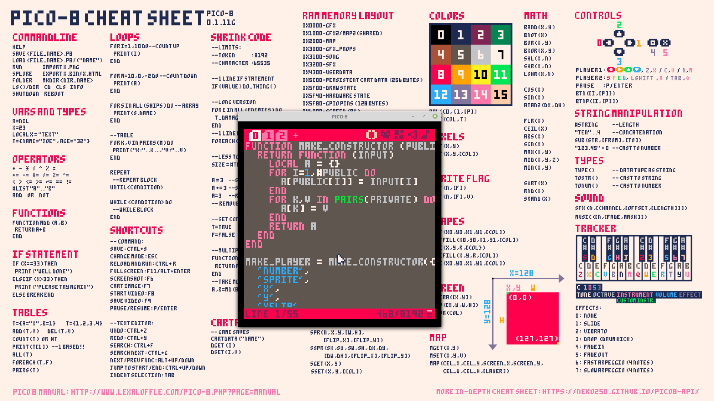
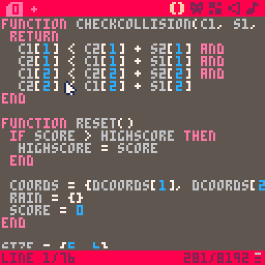
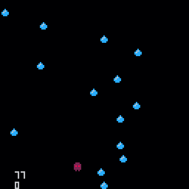
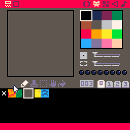
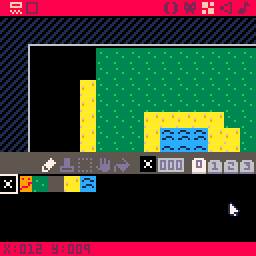
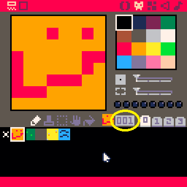
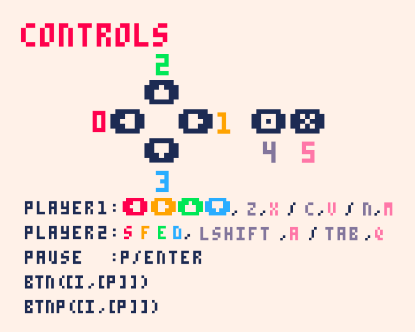
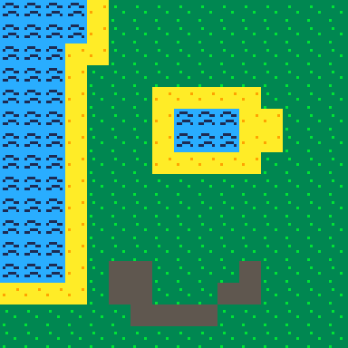
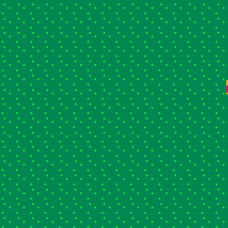

# Pico-8 Action Game

## Why Pico-8?
I consider Pico-8 to be *the best* way to introduce newcomers to coding because of just how fun it is to code in it. Unlike traditional game engines, Pico-8 manages to preserve a traditional coding feel while also streamlining the whole game development process: you still write legitimate Lua code and implement all game systems (like animation, physics, and scenes) yourself. This is good in the long run because that means that beginners get to actually code their games from scratch, rather than gluing together a bunch of pre-made elements. At the same time, however, Pico-8 makes implement graphics, tilemaps, and even music a breeze by including all of those tools into the same package. This means that there's no more need in teaching beginners multiple pieces of software and how to make them work together, as everything is already there: for example, displaying a sprite from a spritesheet is as simple as `spr(0)`!

## Setup
This workshop requires a copy of [Pico-8](https://www.lexaloffle.com/pico-8.php), which unfortunately costs $15. The good news is that Pico-8 is DRM-free, which means that you can share one license with your whole club.

It is also strongly recommended that you download this wonderful cheatsheet:


One common practice is to fullscreen it behind Pico-8, like so:



## Let's start!
Tired of complex workflows and high-definition graphics? Well, the Pico-8 fantasy console is here to help. Through the course of this workshop you will make [this](demos/final.html) action game. Along the way you'll learn how to use the Pico-8 console along with the basics of Lua scripting.

<iframe src="demos/final.html" width="100%" height="700px">
  <image src="assets/final.gif">
</iframe>

A couple of basic pieces of information about Pico-8: there are three modes.

 * The console mode

   

   This is what you see on startup, and allows you to run a couple of basic commands. Don't worry too much about it for now.

 * The editor mode

   

   This is where you make your game. The editor has multiple tabs that give you access to various bits of functionality. **You can get to it by pressing `Esc` from the console mode.**
 * The game mode

   

   This is where you can test your game. **You can get to it by pressing `Ctrl-R`. To get back to the editor, press `Esc` twice.**

## Making sprites and maps

(Note: A great way to learn about this is to load an existing game, such as Celeste, and editing it there--that way, changes are immediate.)

Let's make our game's protagonist. To do this, first go to the editor mode. In the top right of the screen, you'll see five icons: The second icon from the left (the little face) will take us to the **sprite editor** once we click it.

We can make drawings in the (currently empty) blank square to the left. The square to the right filled with colors is our pallet; click on a color to select it for drawing. Try making a few images, called **sprites.** If you want to make multiple ones, click on a blank spot in the bottom to start drawing a new sprite. 



I've made a few sprites: A player, some grass, some water, and some sand. With the grass, water, and sand sprites, I will draw an island that our game will take place in. 

To put together these sprites to form a game world, we go to the map editor (the square icon in the top right). At the bottom of the map view, I can select sprites, and then add them to the map.



The map is very large. To see more, we can use the scroll wheel to zoom out, or hold the middle moust button down while dragging the mouse to scroll the portion of the map we're looking at. Try it out to see how large the map is!

Now that I've made my player and island, I'll need to use some code to display them to the screen. Feel free to pause here and customize your game: Build a town or farm instead of an island, have a player better than my atrocious smiley face--the possibilites are endless! 

## Code, oh my


Every game has something called a gameloop, which is code that is called every frame. This gameloop is split into three parts: first, the game collects user input (is the right arrow pressed?). Then, the game updates some internal variables (move the player right). Finally, the game redraws the screen to reflect the new state.

In Pico-8, you can define that drawing phase by placing code in the following way:
```lua
function _draw()

 -- place code here!

end
```
Don't worry about what exactly is going on here, just understand that anything that goes in-between the `function` and `end` will be drawn onto the screen.

Sidenote: in Pico-8, any line of code that begins with `--` is ignored, so it's useful for writing various comments about the code.

With that in mind, let's draw our sprite. 

```lua
function _draw()

 spr(1, 10, 10)

end
```
`spr` is what is called a function: some code that can be run at any point. We can also pass information into functions, which is what we're doing in this example. Concretely, `spr` accepts 3 pieces of information (in this order):
 * which sprite your drawing
 * x coordinate of the top left corner
 * y coordinate of the top left corner
Note how I give Pico-8 a number to indicate the sprite I'm drawing. Each sprite has its own number, and it can be found in the sprite editor, to the right of the sprite. In the image below, the sprite number is in number in the yellow circle.



So, `spr(1, 10, 10)` will draw sprite number 1 at the point `(10, 10).` 

When you actually execute this (`Ctrl-R`), you may notice you still have artifacts from the console. To fix this, we will use the `cls()` function, which clears the screen. That way, anything you typed in the console earlier will be erased and won't block our view of the game.

```lua
function _draw()

 cls() -- this clears the screen
 spr(1, 10, 10)

end
```
Now every frame will start from a blank screen.

One thing to note: Coordiantes work a little different in Pico-8. The point `(0, 0)` is in the top left corner, and making the y-coordinate bigger actually makes the point go down, not up.


So, the point `(10, 10)` can be thought of as going 10 pixels to the right of the top left pixel, and then going 10 pixels. 

## Variables
Right now our "game" is a little boring, as the square isn't moving at all. The reason behind this is that we're always giving it the same coordinates. The solution? Variables.
Variables are essentially little boxes that allow you to store a value, like a number.
```lua
x = 3
```

Whenever Pico-8 comes across a variable it replaces that variable with the value that is currently stored in it, so

```lua
x = 3
y = x -- y is now 3
```
turns into
```lua
x = 3
y = 3 -- y is now 3
```
Following the same principal, the following code will increment x by 1:
```lua
x = 3
x = x + 1 -- x is now 4
```
(turns into)
```lua
x = 3
x = 3 + 1 -- x is now 4
```
We can use this in our code by making an `x` variable and then changing it periodically.
```lua
x = 3

function _draw()
 cls()
 spr(1, x, 10)
end
```
Pico-8 provides another function for the update phase of the game-loop called `_update`. This function is run every loop before the `_draw` function, and so allows us to modify any variables we want. Let's modify the `x` variable so that our sprite moves to the right:
```lua
x = 0

function _update()
 x = x + 1 -- increment x by 1
end

function _draw()
 cls()
 spr(1, x, 10)
end
```


## Values
A value is anything that you can place into a variable. The most basic type is a number. As you saw earlier, there are also several operations that result in numbers:
```lua
3 + 3 -- 6, addition
3 - 3 -- 0, subtraction
3 * 3 -- 9, multiplication
3 / 3 -- 1, division
3 ^ 3 -- 27, to the power of
```
Whenever Pico-8 comes across one of these operations, it replaces the operation with its result, so `3 + 3` becomes `6`.

The other important type is a boolean, which is just `true` or `false`. There are also operations that result in booleans:
```lua
4 == 4 -- true, equal to
4 ~= 4 -- false, not equal to

4 < 4 -- false, less than
4 <= 4 -- true, less than or equal to
4 > 4 -- false, greater than
4 >= 4 -- true, greater than or equal to

true and false -- false
true or false -- true
```
We can combine these to form complex expressions, like

## User input
Before coding a solution to any problem, it's always way more useful to approach it from a high level. So here's a problem: how do we give the user the ability to control the square?
 * Well, we need to make it so that the square only moves when the user presses certain buttons.
 * We need to increment x when the user presses 'right' and decrement x when the user presses 'left'.
 * We need to modify the `_update` function so that it check if 'right' or 'left' were pressed and modifies x accordingly.
But how do we run some code only sometimes? Welcome the `if` statement.
```lua
if true then
 print(1)
end
```
If the boolean between the `if` and `then` is `true` then the up to `end` is run. Otherwise, Pico-8 just skips the whole expression. This becomes very powerful when you combine it with the `btn` function, which returns a boolean depending on whether a button is pressed. We can consult the cheatsheet to find out more:



As shown on the cheatsheet, `btn` accepts a number (0-6) that denotes a keyboard button. Knowing that, try to write an implementation. Once you're done you can check your solution against ours:

```lua
function _update()
 if btn(1) then
  x = x + 1
 end
end
```
Now, every frame, Pico checks if the right button is pressed, and if so increases the x. Here is the complete code with the other direction added:

```lua
x = 0
y = 0

function _update()
 if btn(1) then -- right
  x = x + 1
 elseif btn(0) then -- left
  x = x - 1
 end
end

function _draw()
 cls()
 spr(1, x, y)
end
```

The code under `elseif` will only run if the first `if` statement is false - this makes it useful for grouping multiple conditions that you know can't all be true (e.g. you know that the player can't be moving right and left at the same time). If we had just made another if for moving left, then pressing down both right and left would have caused the player to stand still.

Notice that `elseif` doesn't require a separate `end`, and is sort-of grouped with the if. There is one last type of if and that is else - else is only evaluated if the previous `if`s and `elseif`s were all false. Here is an example to sum this up:

```lua
if false then
 -- this is not run
elseif false then
 -- this is not run
elseif false then
 -- this is not run
else
 -- this is run
end
```

Each `if` block has to have exactly one `if` and then can also optionally have one `else` and any number of `elseifs`.

## Part 2: the map

If you remember, earlier you drew a map where your game would take place. But currently, the background of our game is a blank screen. This is very boring--let's get our map in the game!

To do this, we're going to start drawing our map to the game. We can do this in Pico using the `map` function. Since `map` draws the map onto the screen, we'll add it to the `_draw` function.

```lua
function _draw()
 cls()
 spr(1, x, y)
 
 map()
end
```



Now, our map appears--but our player disappears! This is because Lua runs code in order. So, it will start by clearing the screen. Then, it will draw the sprite. Then, it will draw the map. But once we draw the map, it covers the player! Since we want the player to cover the map, we'll draw the map first, and then the player.

```lua
function _draw()
 cls()
 map()
 
 spr(1, x, y)
end
```


## Big maps, small screens

Now, we still have an issue: The map is big. So big, the screen can't fit it all at once! 

The player can try moving off the screen, but it's no help: The player runs off the screen to a different part of the map, but Pico doesn't follow him, and we only see the starting area.


So, we need to tell Pico to run along with the player once they go to another part of the map. We can do this using the `camera` function. 

Pico has a little camera which takes pictures of what it sees, and then reports it back to us. At the start of the game, the camera is at the top left corner of the map, so it only sees the tiny portion of the map that can fit on the screen. Since our code only tells the player to move, and never moves the camera, we don't follow the player around!

So, we need to move the camera around with the player. One way of doing it might be to tell the camera to move with the player, by adding this to the end of our `_update` function

```lua
function _update()
 camera(x, y) -- move the camera to (x, y), the same place the player is
end
```

But this doesn't end up looking very nice...


The issue is the camera is in the same spot as the top left of the player. And since the camera makes the pixel it occupies become the top left corner of the picture it takes, the player will always be in the top left. 

We can fix this in multiple ways: We could try to offset the camera a little so that the player ends up in the center of the screen (how Mario does it), or make it so the camera stays mostly still, but 'jumps' everytime the player leaves the screen (like Zelda). We'll be implementing the second approach in this workshop, but feel free to try implementing the first one if you want to. 

## Fixing the camera

Let's divide the map into a number of screen sized 'rooms.' We want the camera to display the 'room' the player is currently in, like so:


To achieve this, we'll need to do two things:
 * Determine the top left corner of the room the player is in
 * Move the camera to that top left corner
 
So, let's try and figure out the top left corner of the room the player is in.

To do this, let's look at a few examples. Remember that the screen is 128 by 128 pixels, and our rooms are also going to be 128 by 128 pixels.

The starting room the player is in has a top left corner of `(0, 0).` If the player moves 128 pixels to the right of that point, to get to `(128, 0),` they will run into the second room. So, the top left corner of this second room is `(128, 0).` However, if the player moves to `(134, 0)` they will still be in the second room. To deal with this, I will start by dividing the x-coordinate by 128 like so:

```lua
function _update()
 roomx = flr(x / 128)
end
```

The `flr` function stands for floor, and just means to round down to the nearest whole number: So `flr(14.32)` is 14, and `flr(4213.999)` is 4213. Why might this be useful? Because it tells us how many times 128 fits into the x-coordinate of the player. So, `flr(134 / 128)` and `flr(128 / 128)` both give back 1, indicating that 128 goes into both 134 and 128 only once. 

Then, we multiply this number by 128.
```lua
function _update()
 roomx = flr(x / 128)
 roomx = roomx * 128
end
```
Thus, if you're at an x-coordinate of 134, the first line will set `roomx` to 1, and the next line will set `roomx` to 128. More generally, the first line of code will find out how many rooms to the right you've gone, and then the next line of code will multiply that number by 128, since each room is 128 pixels wide. This will help us find the x coordinate of the top left corner of the room: First, we find which room we're talking about by doing `flr(x / 128),` and then we multiply by 128 since each room is 128 pixels wide.

We can do something similar to find the y-coordinate (try and figure it out yourself before checking our code) and then set the camera to this `(roomx, roomy)` coordinate.

```lua
function _update()
 roomx = flr(x / 128)
 roomx = roomx * 128
 
 roomy = flr(y / 128)
 roomy = roomy * 128
 
 camera(roomx, roomy)
end
```

Now, we will have the camera system we wanted!
## Borders

While the map is big, it's not infinite: 1024 pixels by 512 pixels, to be precise. This can cause issues with our current movement system, as if the player walks too far in any direction, they will go off the screen. We need to stop this!

First, let's stop the player from moving too far left or too far right.

Once again, try to implement this yourself and then compare your solution with ours. Remember that one problem can have many solutions--so even if your solution does not look exactly like ours, it still might be valid. Just be sure to carefull test it (try all four edges: top, left, right, bottom, and top). 

One naive way might be the following:

```lua
function _update()
 -- our input code from earlier goes here

 if x < 0 then
  x = 0
 end
 if x >= 1024 then
  x = 1024
 end
end
```
There is a problem with this code, however, which is that the player can actually still go off the map. The reason that this happens has to due with how coordinates in Pico work.



Because the coordinates refer to the left hand corner, it is still possible to go a little bit left of the edge. As our sprite is 8 pixels wide, we have to go 7 pixels further to get to the right side of our sprite-- so `(x + 7, y)` would refer to the top right corner of our sprite.

So, we need to make sure `(x + 7, y)` is left of the edge, not `(x, y).` To do this, we only slightly tweak our code. Let's think about where the edge will be. The pixel `(0, 0)` is the top left pixel of the map, and the pixel `(1023, 0)` will be the pixel at top right (note that it's 1023, not 1024--this is because the pixels with an x-coordiante of 0 still take up space on the screen. So the pixel `(1, 0)` actually means the pixel in the second column of pixels, and `(1023, 0)` actually means the pixel in the 1024th column). So, we need to make sure that `x + 7 <= 1023.` Subtracting 7, this is the same as making sure `x <= 1016.` 

Here is the updated code:

```lua
function _update()
 if x < 0 then
  x = 0
 end
 if x > 1016 then -- if x is larger than 1016, move it back to 1016
  x = 1016
 end
end
```

Now, we can't go off the edge anymore! Try preventing the player from going off the screen by going up or down as well.   

## Making solid tiles
