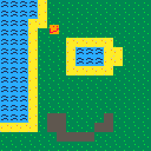
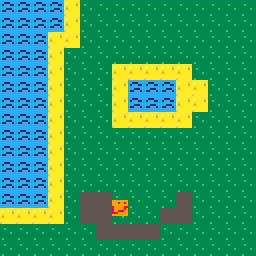
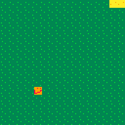
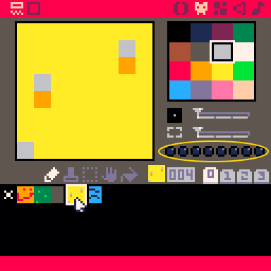

# Pico-8 Action Game

## Why Pico-8?
I consider Pico-8 to be *the best* way to introduce newcomers to coding because of just how fun it is to code in it. Unlike traditional game engines, Pico-8 manages to preserve a traditional coding feel while also streamlining the whole game development process: you still write legitimate Lua code and implement all game systems (like animation, physics, and scenes) yourself. This is good in the long run because that means that beginners get to actually code their games from scratch, rather than gluing together a bunch of pre-made elements. At the same time, however, Pico-8 makes implement graphics, tilemaps, and even music a breeze by including all of those tools into the same package. This means that there's no more need in teaching beginners multiple pieces of software and how to make them work together, as everything is already there: for example, displaying a sprite from a spritesheet is as simple as `spr(0)`!

## Setup
This workshop requires a copy of [Pico-8](https://www.lexaloffle.com/pico-8.php), which unfortunately costs $15. The good news is that Pico-8 is DRM-free, which means that you can share one license with your whole club.

It is also strongly recommended that you download this wonderful cheatsheet:


One common practice is to fullscreen it behind Pico-8, like so:


## Let's start!
Tired of complex workflows and high-definition graphics? Well, the Pico-8 fantasy console is here to help. Through the course of this workshop you will make [this](demos/final.html) action game. Along the way you'll learn how to use the Pico-8 console along with the basics of Lua scripting.

<iframe src="demos/demo.html" width="100%" height="700px">
  <image src="assets/demo.gif">
</iframe>

A couple of basic pieces of information about Pico-8: there are three modes.

 * The console mode

   

   This is what you see on startup, and allows you to run a couple of basic commands. Don't worry too much about it for now.

 * The editor mode

   

   This is where you make your game. The editor has multiple tabs that give you access to various bits of functionality. **You can get to it by pressing `Esc` from the console mode.**
 * The game mode

   

   This is where you can test your game. **You can get to it by pressing `Ctrl-R`. To get back to the editor, press `Esc` twice.**

## Making sprites and maps

(Note: A great way to learn about this is to load an existing game, such as Celeste, and editing it there--that way, changes are immediate.)

Let's make our game's protagonist. To do this, first go to the editor mode. In the top right of the screen, you'll see five icons: The second icon from the left (the little face) will take us to the **sprite editor** once we click it.

We can make drawings in the (currently empty) blank square to the left. The square to the right filled with colors is our pallet; click on a color to select it for drawing. Try making a few images, called **sprites.** If you want to make multiple ones, click on a blank spot in the bottom to start drawing a new sprite. 


I've made a few sprites: A player, some grass, some water, and some sand. With the grass, water, and sand sprites, I will draw an island that our game will take place in. 

To put together these sprites to form a game world, we go to the map editor (the square icon in the top right). At the bottom of the map view, I can select sprites, and then add them to the map.


The map is very large. To see more, we can use the scroll wheel to zoom out, or hold the middle moust button down while dragging the mouse to scroll the portion of the map we're looking at. Try it out to see how large the map is!

Now that I've made my player and island, I'll need to use some code to display them to the screen. Feel free to pause here and customize your game: Build a town or farm instead of an island, have a player better than my atrocious smiley face--the possibilites are endless! 

## Code, oh my


Every game has something called a gameloop, which is code that is called every frame. This gameloop is split into three parts: first, the game collects user input (is the right arrow pressed?). Then, the game updates some internal variables (move the player right). Finally, the game redraws the screen to reflect the new state.

In Pico-8, you can define that drawing phase by placing code in the following way:
```lua
function _draw()

 -- place code here!

end
```
Don't worry about what exactly is going on here, just understand that anything that goes in-between the `function` and `end` will be drawn onto the screen.

Sidenote: in Pico-8, any line of code that begins with `--` is ignored, so it's useful for writing various comments about the code.

With that in mind, let's draw our sprite. 

```lua
function _draw()

 spr(1, 10, 10)

end
```
`spr` is what is called a function: some code that can be run at any point. We can also pass information into functions, which is what we're doing in this example. Concretely, `spr` accepts 3 pieces of information (in this order):
 * which sprite your drawing
 * x coordinate of the top left corner
 * y coordinate of the top left corner
Note how I give Pico-8 a number to indicate the sprite I'm drawing. Each sprite has its own number, and it can be found in the sprite editor, to the right of the sprite. In the image below, the sprite number is in number in the yellow circle.


So, `spr(1, 10, 10)` will draw sprite number 1 at the point `(10, 10).` 

When you actually execute this (`Ctrl-R`), you may notice you still have artifacts from the console. To fix this, we will use the `cls()` function, which clears the screen. That way, anything you typed in the console earlier will be erased and won't block our view of the game.

```lua
function _draw()

 cls() -- this clears the screen
 spr(1, 10, 10)

end
```
Now every frame will start from a blank screen.

One thing to note: Coordiantes work a little different in Pico-8. The point `(0, 0)` is in the top left corner, and making the y-coordinate bigger actually makes the point go down, not up.


So, the point `(10, 10)` can be thought of as going 10 pixels to the right of the top left pixel, and then going 10 pixels. 

## Variables
Right now our "game" is a little boring, as the square isn't moving at all. The reason behind this is that we're always giving it the same coordinates. The solution? Variables.
Variables are essentially little boxes that allow you to store a value, like a number.
```lua
x = 3
```

Whenever Pico-8 comes across a variable it replaces that variable with the value that is currently stored in it, so

```lua
x = 3
y = x -- y is now 3
```
turns into
```lua
x = 3
y = 3 -- y is now 3
```
Following the same principal, the following code will increment x by 1:
```lua
x = 3
x = x + 1 -- x is now 4
```
(turns into)
```lua
x = 3
x = 3 + 1 -- x is now 4
```
We can use this in our code by making an `x` variable and then changing it periodically.
```lua
player_x = 3

function _draw()
 cls()
 spr(1, player_x, 10)
end
```
Pico-8 provides another function for the update phase of the game-loop called `_update`. This function is run every loop before the `_draw` function, and so allows us to modify any variables we want. Let's modify the `player_x` variable so that our sprite moves to the right:
```lua
player_x = 0

function _update()
 player_x = player_x + 1 -- increment x by 1
end

function _draw()
 cls()
 spr(1, player_x, 10)
end
```


## Values
A value is anything that you can place into a variable. The most basic type is a number. As you saw earlier, there are also several operations that result in numbers:
```lua
3 + 3 -- 6, addition
3 - 3 -- 0, subtraction
3 * 3 -- 9, multiplication
3 / 3 -- 1, division
3 ^ 3 -- 27, to the power of
```
Whenever Pico-8 comes across one of these operations, it replaces the operation with its result, so `3 + 3` becomes `6`.

The other important type is a boolean, which is just `true` or `false`. There are also operations that result in booleans:
```lua
4 == 4 -- true, equal to
4 ~= 4 -- false, not equal to

4 < 4 -- false, less than
4 <= 4 -- true, less than or equal to
4 > 4 -- false, greater than
4 >= 4 -- true, greater than or equal to

true and false -- false
true or false -- true
```
We can combine these to form complex expressions, like

## User input
Before coding a solution to any problem, it's always way more useful to approach it from a high level. So here's a problem: how do we give the user the ability to control the square?
 * Well, we need to make it so that the square only moves when the user presses certain buttons.
 * We need to increment x when the user presses 'right' and decrement x when the user presses 'left'.
 * We need to modify the `_update` function so that it check if 'right' or 'left' were pressed and modifies x accordingly.
But how do we run some code only sometimes? Welcome the `if` statement.
```lua
if true then
 print(1)
end
```
If the boolean between the `if` and `then` is `true` then the up to `end` is run. Otherwise, Pico-8 just skips the whole expression. This becomes very powerful when you combine it with the `btn` function, which returns a boolean depending on whether a button is pressed. We can consult the cheatsheet to find out more:


As shown on the cheatsheet, `btn` accepts a number (0-6) that denotes a keyboard button. Knowing that, try to write an implementation. Once you're done you can check your solution against ours:

```lua
function _update()
 if btn(1) then
  player_x = player_x + 1
 end
end
```
Now, every frame, Pico checks if the right button is pressed, and if so increases the x. Here is the complete code with the other direction added:

```lua
player_x = 0
player_y = 0

function _update()
 if btn(1) then -- right
  player_x = player_x + 1
 elseif btn(0) then -- left
  player_x = player_x - 1
 end
end

function _draw()
 cls()
 spr(1, player_x, player_y)
end
```

The code under `elseif` will only run if the first `if` statement is false - this makes it useful for grouping multiple conditions that you know can't all be true (e.g. you know that the player can't be moving right and left at the same time). If we had just made another if for moving left, then pressing down both right and left would have caused the player to stand still.

Notice that `elseif` doesn't require a separate `end`, and is sort-of grouped with the if. There is one last type of if and that is else - else is only evaluated if the previous `if`s and `elseif`s were all false. Here is an example to sum this up:

```lua
if false then
 -- this is not run
elseif false then
 -- this is not run
elseif false then
 -- this is not run
else
 -- this is run
end
```

Each `if` block has to have exactly one `if` and then can also optionally have one `else` and any number of `elseifs`.

## Part 2: the map

If you remember, earlier you drew a map where your game would take place. But currently, the background of our game is a blank screen. This is very boring--let's get our map in the game!

To do this, we're going to start drawing our map to the game. We can do this in Pico using the `map` function. Since `map` draws the map onto the screen, we'll add it to the `_draw` function.

```lua
function _draw()
 cls()
 spr(1, player_x, player_y)
 
 map()
end
```


Now, our map appears--but our player disappears! This is because Lua runs code in order. So, it will start by clearing the screen. Then, it will draw the sprite. Then, it will draw the map. But once we draw the map, it covers the player! Since we want the player to cover the map, we'll draw the map first, and then the player.

```lua
function _draw()
 cls()
 map()
 
 spr(1, player_x, player_y)
end
```


## Big maps, small screens

Now, we still have an issue: The map is big. So big, the screen can't fit it all at once! 

The player can try moving off the screen, but it's no help: The player runs off the screen to a different part of the map, but Pico doesn't follow him, and we only see the starting area.



So, we need to tell Pico to run along with the player once they go to another part of the map. We can do this using the `camera` function. 

Pico has a little camera which takes pictures of what it sees, and then reports it back to us. At the start of the game, the camera is at the top left corner of the map, so it only sees the tiny portion of the map that can fit on the screen. Since our code only tells the player to move, and never moves the camera, we don't follow the player around!

So, we need to move the camera around with the player. One way of doing it might be to tell the camera to move with the player, by adding this to the end of our `_update` function

```lua
function _update()
 camera(player_x, player_y) -- move the camera to (player_x, player_y), the same place the player is
end
```

But this doesn't end up looking very nice...


The issue is the camera is in the same spot as the top left of the player. And since the camera makes the pixel it occupies become the top left corner of the picture it takes, the player will always be in the top left. 

We can fix this in multiple ways: We could try to offset the camera a little so that the player ends up in the center of the screen (how Mario does it), or make it so the camera stays mostly still, but 'jumps' everytime the player leaves the screen (like Zelda). We'll be implementing the second approach in this workshop, but feel free to try implementing the first one if you want to. 

## Fixing the camera

Let's divide the map into a number of screen sized 'rooms.' We want the camera to display the 'room' the player is currently in, like so:



To achieve this, we'll need to do two things:
 * Determine the top left corner of the room the player is in
 * Move the camera to that top left corner
 
So, let's try and figure out the top left corner of the room the player is in.

To do this, let's look at a few examples. Remember that the screen is 128 by 128 pixels, and our rooms are also going to be 128 by 128 pixels.

The starting room the player is in has a top left corner of `(0, 0).` If the player moves 128 pixels to the right of that point, to get to `(128, 0),` they will run into the second room. So, the top left corner of this second room is `(128, 0).` However, if the player moves to `(134, 0)` they will still be in the second room. To deal with this, I will start by dividing the x-coordinate by 128 like so:

```lua
function _update()
 roomx = flr(player_x / 128)
end
```

The `flr` function stands for floor, and just means to round down to the nearest whole number: So `flr(14.32)` is 14, and `flr(4213.999)` is 4213. Why might this be useful? Because it tells us how many times 128 fits into the x-coordinate of the player. So, `flr(134 / 128)` and `flr(128 / 128)` both give back 1, indicating that 128 goes into both 134 and 128 only once. 

Then, we multiply this number by 128.
```lua
function _update()
 roomx = flr(player_x / 128)
 roomx = roomx * 128
end
```
Thus, if you're at an x-coordinate of 134, the first line will set `roomx` to 1, and the next line will set `roomx` to 128. More generally, the first line of code will find out how many rooms to the right you've gone, and then the next line of code will multiply that number by 128, since each room is 128 pixels wide. This will help us find the x coordinate of the top left corner of the room: First, we find which room we're talking about by doing `flr(player_x / 128),` and then we multiply by 128 since each room is 128 pixels wide.

We can do something similar to find the y-coordinate (try and figure it out yourself before checking our code) and then set the camera to this `(roomx, roomy)` coordinate.

```lua
function _update()
 roomx = flr(player_x / 128)
 roomx = roomx * 128
 
 roomy = flr(player_y / 128)
 roomy = roomy * 128
 
 camera(roomx, roomy)
end
```

Now, we will have the camera system we wanted!

## Quick detour: Functions

We're going to talk about making our own functions, since our `_update` function is getting really crowded and we still have more to go! 

We've used functions before, like `cls()` and `map()`

Functions are essentially just blocks of code that we group together. When we use a function (when we 'call the function'), we just run all the code inside of it. As an example, consider this code
```lua
function prep_screen()
 cls()
 map()
end

function _draw()
 prep_screen()
 
 spr(1, player_x, player_y)
end
```

which is exactly the same as this code

```lua
function _draw()
 cls()
 map()
 
 spr(1, player_x, player_y)
end
```

Functions can also take in arguments--that is, information. As an example, consider `spr.` `spr` takes in three pieces of information (arguments): the sprite number, the x-coordinate of where to draw it, and the y-coordinate of where to draw it. 
Functions can also return information, making it avaliable to us. 

Let's see an example. Earlier, we had some code which computed the corner of the room the player was in. Let's make some functions which take a point's coordinates, and returns the corner of the room the point is in. This way, in our `_update` function, we can use these two smaller functions.

```lua
function room_corner_x(x, y) -- this function takes in an x value and a y value
 roomx = flr(x / 128)
 roomx = roomx * 128
 return roomx
end

function room_corner_y(x, y)
 roomy = flr(y / 128)
 roomy = roomy * 128
 return roomy
end

function _update()
 camera(room_corner_x(player_x, player_y), room_corner_y(player_x, player_y))
end
```

So, when we run `_update,` it will ask `room_corner_x` to compute the x coordinate of the room, and then `room_corner_y` to compute the y coordinate of the room. Say that `room_corner_x` finds a value of 128 and `room_corner_y` a value of 256. Then, the line of code 

```lua
camera(room_corner_x(player_x, player_y), room_corner_y(player_x, player_y))
```

will be replaced with

```lua
camera(128,  256)
```

Functions can be helpful when we have a lot of code, and soon we'll see very powerful things functions can do.

## Chickens

Our player is fairly lonely. Let's give them some company by adding chickens to the game. The chickens will move around the screen as they please--the player will not be able to control them.


While I'll be adding chickens to my game, feel free to add whatever type of animal you want to yours--a pig, a cow, or even an asteroid!

Like our player, each chicken needs an x and a y coordinate. Let's see what that might look like:

```lua
chicken1_x = 45
chicken1_y = 70

chicken2_x = 60
chicken2_y = 32
```

The x and y values I choose were arbitrary--you can make them anywhere on the screen if you want.

Now that we have this, let's start drawing the chicken to the screen. We'll do this using the sprite function from earlier. I use sprite number 6 as my chicken sprite, but you may have yours in a different spot--make sure to check the sprite number before copying this code!

```lua
chicken_sprite = 6

function _draw()
 spr(chicken_sprite, chicken1_x, chicken1_y)
 spr(chicken_sprite, chicken2_x, chicken2_y)
end
```

I use `chicken_sprite` instead of 6 when using `spr` to help prevent errors--if I had a typo and accidentally typed 5 in the first call, I'd get some weird looking chickens. Now if I have a typo, for example mistakenly typing `chicken_site` Pico will give me an error since it doesn't know what `chicken_site` is.

Now, my chickens will be on screen, but they won't move at all! (If you can't see your chickens, they might be in a different room--try wandering around your map more, or move the chickens to start in the same room as the player.)

This is because we never change the x and y coordinates of the chickens. We moved the player by reading the key input--but these chickens should move on their own, not be controlled by the player! So, how should we move chickens?

At a high level, we might think of this movement plan:
 * Pick a random direction the chicken will move in
 * Move in that direction for a few seconds
 * Pick a new direction and start again

Let's start by picking random directions. In Pico, we can generate random numbers using the `rnd` function. `rnd` takes an upper bound, and generates random numbers between 0 and the upper bound. For example, `rnd(2)` can generate 0, 1, 0.5923, or 1.94523, but it won't generate 2 (the upper bound isn't included), -0.0532, or 2.52. 

First, I will pick a direction to move horizontally: Left, right, or don't move horizontally. There are three possibilities here, so to capture them all I will use `flr(rnd(3)).` This is because `rnd(3)` will give us a number from 0 to 1, a number from 1 to 2, or a number from 2 to 3. If it gives us a number between 0 and 1, `flr(rnd(3))` will give us 0. If it gives us a number between 1 and 2, `flr(rnd(3))` will give us 1. And if it gives us a number between 2 and 3, `flr(rnd(3))` will give us 2. So, `flr(rnd(3))` will randomly generate either 0, 1, or 2-- three values, each of which corresponds to a direction.

Now, we can add some code to update which moves the chickens randomly in a direction:

```lua
chicken1_directionx = 0

function _update()
 chicken1_directionx = flr(rnd(3)) -- pick chicken1's horizontal direction
 
 if chicken1_directionx == 0 then
  chicken1_x = chicken1_x - 1 -- move left
 elseif chicken1_directionx == 1 then
  chicken1_x = chicken1_x + 1 -- move right
 end -- since a direction of 2 corresponds to not moving, we do nothing in that case
end
```

(A clever way of doing the same thing with less code is to do subtract 1 from the direction, and then set `chicken1_x` to `chicken1_x + direction.` Try working out how this does exactly the same thing as the long `if` statement.)

Now that we have horizontal movement, also add in vertical movement.

## Fixing our chicken movement

The movement system from before words, but it looks very artificial and jagged; look at this:


This is because the chickens randomly pick a new direction to move in after moving just one step in the new direction! Real chickens are not so indecisive; they'll pick a direction and stick with it for a few seconds, before picking a new one.

To deal with this, let's go back to our movement idea:
 * Pick a random direction the chicken will move in
 * Move in that direction for a few seconds
 * Pick a new direction and start again

We're picking a random direction, but we're not moving in it for a few seconds--just for a moment. To fix this, let's also randomly generate a length of time to move in the new direction.

```lua
chicken1_path_length = 0
chicken2_path_length = 0
```

`path_length` will represent the length we're going to travel before changing directions again. So, let's tweak our `_update` function:

```lua
function _update()
 if chicken1_path_length > 0 then
  -- move the chicken according to its direction like before
  
  -- now, subtract 1 from path length since our chicken just took 1 step
  chicken1_path_length = chicken1_path_length - 1
 else 
  -- pick a new direction for the chicken like before
  
  -- now, randomly generate a path length
  chicken1_path_length = flr(rnd(30)) + 10
 end
end
```

I added 10 to `flr(rnd(30))` so that it isn't too small--this way, I know that the path will always be at least 10 steps long. Feel free to change the numbers 10 and 30 as you please to make the movement fit well with your game and the object you're making.

## Tables: A place to keep all of your chicken information

Our chicken movement looks smooth, but our code is a little messy: I have a lot of variables starting with `chicken1` or `chicken2,` and adding a third chicken would be a nightmare: I'd have to add a lot more variables and add a lot of code to our `_update` and `_draw` functions to take care of the chicken. To help make this easier, I'm going to use a combination of **tables** and **functions** (remember functions?). 

First, what is a table? A table is essentially a collection of related variables. 

Let's see an example:

```lua
chicken1 = {} -- use this to tell Pico that my_cool_table is, in fact, a table
chicken1.x = 30
chicken1.y = 52
chicken1.directionx = 0
chicken1.directiony = 0
chicken1.path_length = 0
```

In the example, `chicken1` is a table holding a few variables: `x, y, directionx, directiony,` and `path_length.` All of these variables are related to `chicken1` and so we're grouping them together.

**Warning:** We can't just say `x` or `y` to use the variables inside `chicken1.` We have to say `chicken1.x` and `chicken1.y` to tell Pico to look for x and y inside of the `chicken1` table.

We can use functions to automate this a little. We know that each chicken has a x coordinate, y coordinate, a direction, and a path length. So, I will make a function which takes in this information and gives back a table containing it all.

```lua
function make_chicken(x, y, directionx, directiony, path_length)
 new_chicken = {} -- tell Pico that new_chicken will be a table
 new_chicken.x = x
 new_chicken.y = y
 new_chicken.directionx = directionx
 new_chicken.directiony = directiony
 new_chicken.path_length = path_length
end
```

One important thing to note is that, in the line `new_chicken.x = x,` the code `new_chicken.x` refers to the x value inside of the `new_chicken` table, whereas the code `x` on the rightside refers to the value for `x` that our function recieves (the argument). 

Now, we can replace all of our chicken variables with the following two lines of code:

```lua
chicken1 = make_chicken(30, 50, 0, 0, 0)
chicken2 = make_chicken(30, 10, 0, 0, 0)
```

## Chicken Functions

Now that we have chicken tables, let's make some chicken functions!

Remember all the code we used to move a chicken? For each new chicken we make, we'd have to add all that code to `_update` but with the new chicken's name. To save ourselves some time, let's put that code into a function:

```lua
function move_chicken(chicken)
 if chicken.path_length > 0 then
  if chicken.directionx == 0 then
   chicken.x = chicken.x - 1
  elseif chicken.directionx == 1 then
   chicken.x = chicken.x + 1
  end
  
  if chicken.directiony == 0 then
   chicken.y = chicken.y - 1
  elseif chicken.directiony == 1 then
   chicken.y = chicken.y + 1
  end
  
  chicken.path_length = chicken.path_length - 1
 else 
  chicken.directionx = flr(rnd(3))
  chicken.directiony = flr(rnd(3))
  
  chicken.path_length = flr(rnd(30)) + 10
 end
end

function _update()
 -- instead of our old chicken movement code, now we just have these two lines:
 move_chicken(chicken1)
 move_chicken(chicken2)
end
```

We can do something similar with `_draw` to make our lives easier:

```lua
function draw_chicken(chicken)
 spr(chicken_sprite, chicken.x, chicken.y)
end

function _draw(chicken)
 -- instead of our spr calls, we can just use this:
 draw_chicken(chicken1)
 draw_chicken(chicken2)
end
```

Now, adding more chickens is easier than before--but still not as easy as possible. I'd like to just be able to use one function, `make_chicken,` to create a new chicken, and then never have to worry about that chicken again--have the code do everything. For that, we'll need...

## A table of chickens

A table holds a group of related variables. Our `chicken1` and `chicken2` variables are related, so let's put them in a table together:

```lua
chickens = {}
chickens.chicken1 = chicken1
chickens.chicken2 = chicken2
```

Now, we can use a powerful function called `foreach.` 

```lua
function _update()
 foreach(chickens, move_chicken)
end

function _draw()
 foreach(chickens, draw_chicken)
end
```

`foreach(chickens, move_chicken)` means to do `move_chicken` for each chicken inside of the table `chickens.` So, if we only had `chicken1` and `chicken2` inside of `chickens,` the line

```lua
foreach(chickens, move_chicken)
```

would be replaced with


```lua
move_chicken(chickens.chicken1)
move_chicken(chickens.chicken2)
```

This makes adding more chickens much easier: Now, instead of having to type `move_chicken(chicken3)` in my `_update` function and then `draw_chicken(chicken3)` in the `_draw` function, I can just add `chicken3` to the `chickens` table and Pico will take care of the rest!

This is much better than before, but we're not quite at what I wanted: I want `make_chicken` to do all the work, so I don't have to manually add the code which adds my new chicken to the `chickens` table.

However, we're at a dilemma with implementing this: `make_chicken` has no way of knowing how many chickens are in the table--it doesn't know if it should add the new chicken to `chickens.chicken3,` `chickens.chicken4,` or `chickens.chicken500.`

Luckily, Pico has a workaround: The `add` function. `add(chickens, new_chicken)` will put `new_chicken` at the end of the `chickens` table. So, we just need to add that one line of code to `make_chicken`, and then whenever we want to make a new chicken, we just use `make_chicken` and Pico will do the rest for us!

## Loops

Let's say I want to have 10 chickens in my game. Before, I'd have to add a lot of code. Now, at the start, I just do

```lua
make_chicken(0, 0, 0, 0, 0)
make_chicken(10, 10, 0, 0, 0)
make_chicken(20, 20, 0, 0, 0)
make_chicken(30, 30, 0, 0, 0)
make_chicken(40, 40, 0, 0, 0)
make_chicken(50, 50, 0, 0, 0)
make_chicken(60, 60, 0, 0, 0)
make_chicken(70, 70, 0, 0, 0)
make_chicken(80, 80, 0, 0, 0)
make_chicken(90, 90, 0, 0, 0)
```

However, that's still a lot more code than I want. I'd like a function `make_chickens` which takes in a number of chickens, and then makes that many chickens and places them randomly on my map.

How should we do that? Well, to add a chicken at a random location, we'd use

```lua
make_chicken(rnd(128), rnd(128), 0, 0, 0)
```

This will pick a random point in the first room, and add make a chicken there. (If you want your chickens to spawn all over the place, just change `rnd(128), rnd(128)` to `rnd(1024), rnd(512)` since the map is 1024 pixels by 512 pixels.)

Now, I want this code to run a number of times depending on what number I give my `make_chickens` function. To do this, I will use a `for` loop.

```lua
function make_chickens(number_of_chickens)
 for i=1, number_of_chickens do
  make_chicken(rnd(128), rnd(128), 0, 0, 0)
 end
end
```

A `for` loop will run multiple times. Note how we said `i=1, number_of_chickens.` This means that it will create a counter starting at 1, run the code indented below `for` statement and before the `end`, then advance the counter to 2, run the code again, ..., until it finally advances the counter past `number_of_chickens,` at which point it stops.

We can use the counter variable inside the body of our loop if we so desire, but we can't use it before or after the loop.

So, now my 9 chickens can be added with just one line of code:

```lua
make_chickens(9)
```

Talk about easy!


## Borders

Our game is feeling lively now: There's chickens, a player, and great island. Except, the player currently can leave the island and enter an infinite void of darkness...


Why is this happening? Well, our map is only so big. When I moved the player above the top of the map, the game had no idea what that area looks like, so it drew nothing. We'll need to prevent the player from leaving the map.

Remember how coordinates work in Pico? Here's a quick refresher:


The top left corner is (0, 0), and going up makes your y-coordinate go down. So, if we go up above the very top of the screen, our why coordinate will go down below 0. So, to prevent you from leaving the screen from the side, let's prevent your y-coordinate below 0. 

```lua
function _update()
 -- get input and move the player like before
 
 if player_y < 0 then -- if the player went too far up
  player_y = 0 -- send the player back to the edge
 end
end
```

However, the player can still exit the map from the right, left, or bottom. Try to fix this yourself, remembering that the map is 1024 pixels wide by 512 pixels tall (if you didn't use all of the map, you might want to make these bounds smaller).

One solution might be this:

```lua
function _update()
 if player_x < 0 then
  player_x = 0
 elseif player_x > 1024 then
  player_x = 1024
 end

 if player_y < 0 then
  player_y = 0
 elseif player_y > 512 then
  player_y = 512
 end
end
```

However, this code has a very subtle flaw...



Remember that `(player_x, player_y)` is just the top left corner of the player. So, this code will only check if the player's top left corner is good, not the entire player. This works fine for the top and left sides of the screen, but not the bottom or right sides since it's possible for the bottom pixels of the player to be past the line without this code picking up on it.

So, we shouldn't check if `player_y > 512.` We should check if `player_y + 8 > 512` (since the player is 8 pixels wide), meaning we want `player_y > 504.` So, we can change our code like so:

```lua
function _update()
 if player_x < 0 then
  player_x = 0
 elseif player_x > 1016 then
  player_x = 1016
 end

 if player_y < 0 then
  player_y = 0
 elseif player_y > 504 then
  player_y = 504
 end
end
```

Now it works!

However, we've got an awful lot of chickens that can still move into the void. The whole point of the last few sections was to get a lot of chickens with very little code--so having to type this out for each chicken would waste all our old work!

Let's think about how we got so many chickens with very little code. We used functions and `foreach` to do the gruntwork for us.

So, let's do that again. I'll make a function `bound` which takes in a chicken, checks if it's inside the boundaries, and moves it inside if it's not. It's almost exactly the same as the code above:

```lua
function bound(character) 
 if character.x < 0 then
  character.x = 0
 elseif character.x > 1016 then
  player_x = 1016
 end

 if character.y < 0 then
  character.y = 0
 elseif character.y > 504 then
  character.y = 504
 end
end
```

Now, we just use `foreach` like before:

```lua
function _update()
 -- move the chickens
 
 foreach(chickens, bound)
end
```

## Making the player a table

We use tables to group related variables. `player_x` and `player_y` are related, so why not group them? 

```lua
player = {}
player.x = 0 -- this will be the starting position of the player; feel free to change
player.y = 0
```

The advantage to doing this is now our `bound` function works with the player. This is because `bound` **doesn't care what type of table (chicken or player) you give it, it just cares if that table has an `x` and a `y` variable.** This means that we can use `bound` on the player, too!

```lua
function _update()
 -- move the player and chickens
 
 bound(player) -- bound the player
 foreach(chickens, bound) -- bound each chicken
end
```

## Making solid tiles: Flags

Right now, our player can walk on water (in your games, they may be able to walk through walls or on something else they shouldn't be able to). We'd like to stop this, but first we need to tell Pico which things the player can and can't walk on. 

We can do this by going back to the sprite editor and setting **flags** on our sprites.



Those eight little buttons next to the sprite are all flags. By default, they all start as off and we can turn them on by clicking them.

To help Pico know which things we can and can't walk on, let's use flags: Flag 0, the leftmost flag, will represent if the tile can be walked on or not. If the flag is off, the player can walk on it, and if the flag is on, the player cannot walk on it.

In my game, I'll turn on flag 1 for my water sprite, and leave it off for the rest of them.


Now that we've set the flags, we can start programming our collision detection.
